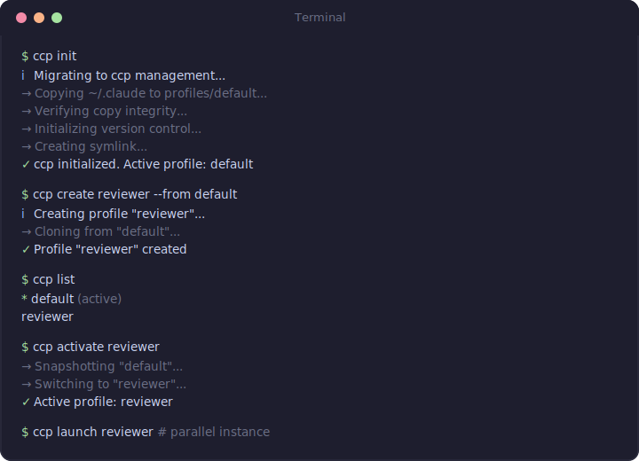
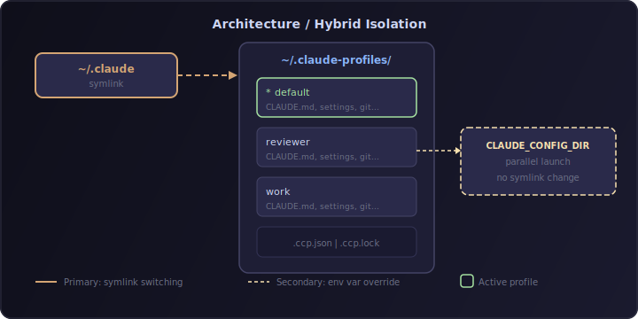

<p align="center">
  
</p>

<p align="center">
  <a href="https://www.npmjs.com/package/claude-code-profile"></a>
  <a href="https://www.npmjs.com/package/claude-code-profile"></a>
  <a href="https://github.com/HaloXie/claude-code-profile/blob/main/LICENSE"></a>
  <a href="https://nodejs.org"></a>
</p>

<p align="center">
  <b>Chrome-like profile management for <a href="https://docs.anthropic.com/en/docs/claude-code">Claude Code</a></b>
  <br/>
  <sub>Fully isolated profiles with selective import, version control, and parallel launch</sub>
</p>

<p align="center">
  <a href="#installation">Install</a> &#8226;
  <a href="#quick-start">Quick Start</a> &#8226;
  <a href="#commands">Commands</a> &#8226;
  <a href="#architecture">Architecture</a> &#8226;
  <a href="#中文文档">中文文档</a>
</p>

---

## Why?

Claude Code stores all configuration in a single `~/.claude` directory. When you need different personas, skills, or rules for different workflows — a strict code reviewer, a creative brainstormer, a company-specific assistant — you're stuck with one config for everything.

**ccp** gives you Chrome-like profiles. Each profile is a fully isolated `~/.claude` equivalent with its own `CLAUDE.md`, settings, plugins, skills, hooks, and memory.

<p align="center">
  
</p>

## Installation

```bash
npm install -g claude-code-profile
```

Alias: The CLI command is **`ccp`** (Claude Code Profile).

## Quick Start

```bash
# 1. Initialize — migrates your existing ~/.claude
ccp init

# 2. Create a new profile (interactive or from existing)
ccp create reviewer
ccp create work --from default

# 3. Switch profiles
ccp activate reviewer

# 4. Run a parallel instance without switching
ccp launch work

# 5. Check which profile is active
ccp current
```

## Architecture

<p align="center">
  
</p>

**Hybrid isolation with two complementary mechanisms:**

| Mechanism | Command | Use Case |
|-----------|---------|----------|
| **Symlink switching** | `ccp activate <name>` | Day-to-day profile switching. `~/.claude` symlink points to active profile. |
| **Env var override** | `ccp launch <name>` | Run multiple Claude instances simultaneously, each with a different profile. |

Each profile directory is a complete `~/.claude` equivalent with its own git repository for automatic version control.

## Commands

### Lifecycle

| Command | Description |
|---------|-------------|
| `ccp init` | Migrate `~/.claude` to profile management (with backup) |
| `ccp pause` | Suspend ccp, restore `~/.claude` as real directory |
| `ccp resume` | Resume ccp management after pause |
| `ccp uninstall` | Fully exit ccp, restore standard `~/.claude` |

### Profile Management

| Command | Description |
|---------|-------------|
| `ccp create <name>` | Create profile (interactive: select source + items to import) |
| `ccp create <name> --from <profile>` | Full clone from existing profile |
| `ccp delete <name>` | Delete profile (with confirmation) |
| `ccp list` | List all profiles, mark active |
| `ccp info <name>` | Show profile details and disk usage |
| `ccp rename <old> <new>` | Rename a profile |
| `ccp copy <src> <dst>` | Duplicate a profile |

### Activation

| Command | Description |
|---------|-------------|
| `ccp activate <name>` | Switch active profile (changes symlink) |
| `ccp deactivate` | Return to default profile |
| `ccp launch <name>` | Start Claude with this profile without switching (via `CLAUDE_CONFIG_DIR`) |
| `ccp current` | Show current active profile |
| `ccp current --badge` | Output `[name]` for status bar integration |

### Import / Export

| Command | Description |
|---------|-------------|
| `ccp import <target> --from <source>` | Selective import between profiles |
| `ccp export <name> -o <path>` | Export profile as `.ccp.tar.gz` |
| `ccp import-archive <path>` | Import profile from archive |

### Version Control

| Command | Description |
|---------|-------------|
| `ccp snapshot <name> [-m "msg"]` | Manual snapshot (git commit) |
| `ccp history <name>` | View profile change history |
| `ccp rollback <name>` | Rollback to a previous snapshot |

### Health

| Command | Description |
|---------|-------------|
| `ccp doctor` | Check symlink integrity, profile validity, auto-repair |

All commands support `-y, --yes` to skip confirmation prompts.

## Importable Items

When creating or importing between profiles, you can selectively choose:

| Item | What's Included |
|------|----------------|
| `auth` | API keys, tokens, credentials |
| `plugins` | Installed plugins + `enabledPlugins` config |
| `skills` | Skill definitions |
| `hooks` | Hook scripts + hook config |
| `mcp` | MCP server configurations |
| `rules` | Rule files, constitution |
| `settings` | `settings.json`, `settings.local.json` |
| `memory` | Project memory files |
| `conversations` | History, sessions |

Settings fields (`enabledPlugins`, `hooks`, `mcpServers`) are merged at **field level**, not file level — importing plugins won't overwrite your model or permission settings.

## Version Control

Every profile is a git repository. Configuration changes are tracked automatically:

- **Auto-commit** on `activate` / `deactivate` (snapshot before switching)
- **Manual snapshot** via `ccp snapshot <name> -m "description"`
- **Non-destructive rollback** via `ccp rollback <name>` (creates a new commit, preserves history)

## Safety

| Scenario | Protection |
|----------|-----------|
| `init` failure | Copy-then-verify-then-symlink; original backed up; rollback on any step failure |
| Concurrent operations | Atomic lock file with stale PID detection |
| Symlink switch | Atomic: temp symlink + rename (POSIX atomic) |
| `activate` while Claude running | Detects claude process, warns user (`--force` to override) |
| `delete` active / default | Refused |
| `export` | Auth excluded by default (`--include-auth` to override) |
| `pause` / `uninstall` | Restores real `~/.claude`; status bar restored to original |

## Status Bar

ccp composes with your existing Claude Code status bar (doesn't override):

```
[reviewer] Your existing status line output here
```

Use `ccp current --badge` in custom status bar scripts.

## Contributing

Contributions are welcome! Please open an issue or submit a PR.

```bash
git clone https://github.com/HaloXie/claude-code-profile.git
cd claude-code-profile
pnpm install
pnpm test        # Run tests
pnpm dev --help  # Run CLI in dev mode
```

## License

[MIT](LICENSE)

---

<a id="中文文档"></a>

# 中文文档

## 简介

**ccp** (Claude Code Profile) 为 [Claude Code](https://docs.anthropic.com/en/docs/claude-code) 提供类似 Chrome 浏览器的配置文件管理功能。每个 Profile 是完全隔离的 `~/.claude` 等价目录，拥有独立的 `CLAUDE.md`、设置、插件、Skills、Hooks 和记忆。

## 为什么需要 ccp？

Claude Code 将所有配置存储在单一的 `~/.claude` 目录中。当你需要不同的人格来完成不同的工作流时——严格的代码审查者、创意头脑风暴者、公司专属助手——你只能共用一套配置。

**ccp** 让你可以为每个场景创建独立的 Profile，像切换 Chrome 用户一样切换 Claude Code 的身份。

## 安装

```bash
npm install -g claude-code-profile
```

CLI 命令别名：**`ccp`**

## 快速开始

```bash
# 1. 初始化 — 迁移现有的 ~/.claude
ccp init

# 2. 创建新 Profile（交互式或从现有 Profile 克隆）
ccp create reviewer
ccp create work --from default

# 3. 切换 Profile
ccp activate reviewer

# 4. 并行启动（不切换当前 Profile）
ccp launch work

# 5. 查看当前激活的 Profile
ccp current
```

## 核心特性

### 完全隔离
每个 Profile 是独立的 `~/.claude` 目录，拥有自己的：
- `CLAUDE.md`（指令文件）
- `settings.json`（模型、权限、环境变量）
- 插件、Skills、Hooks、Rules
- MCP 服务器配置
- 项目记忆和对话历史

### 选择性导入
创建 Profile 时可以从现有 Profile 选择性导入：认证、插件、Skills、Hooks、MCP、规则、设置、记忆、对话。设置字段级合并，不会覆盖目标的其他配置。

### 混合隔离机制
- **主要方式**：`ccp activate` — Symlink 切换（原子操作）
- **并行方式**：`ccp launch` — 通过 `CLAUDE_CONFIG_DIR` 环境变量启动独立实例

### 版本控制
每个 Profile 目录是一个 Git 仓库：
- 切换 Profile 时自动快照
- `ccp snapshot` 手动创建快照
- `ccp rollback` 非破坏性回滚（保留完整历史）

### 安全机制
- `init` 失败时自动回滚，原始目录备份保留
- 原子锁文件 + 过期 PID 检测
- Symlink 原子切换（temp + rename）
- `export` 默认排除认证信息
- `delete` 拒绝删除激活或默认 Profile

## 命令速查

```
ccp init                          初始化，迁移 ~/.claude
ccp pause / resume / uninstall    暂停 / 恢复 / 卸载

ccp create <name>                 创建 Profile（交互式）
ccp create <name> --from <src>    从现有 Profile 克隆
ccp delete / list / info          删除 / 列表 / 详情
ccp rename <old> <new>            重命名
ccp copy <src> <dst>              复制

ccp activate <name>               切换 Profile
ccp deactivate                    回到 default
ccp launch <name>                 并行启动
ccp current [--badge]             当前 Profile

ccp import <target> --from <src>  选择性导入
ccp export <name> -o <path>       导出归档
ccp import-archive <path>         导入归档

ccp snapshot <name> [-m "msg"]    手动快照
ccp history <name>                变更历史
ccp rollback <name>               回滚

ccp doctor                        健康检查
```

## 许可证

[MIT](LICENSE)
