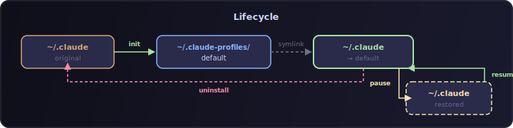
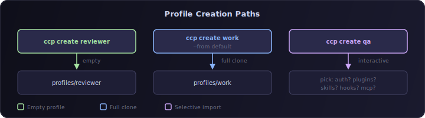
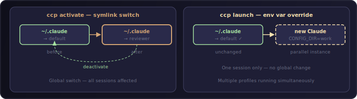
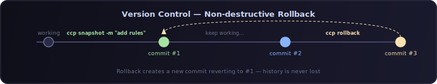
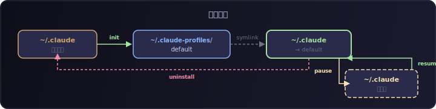
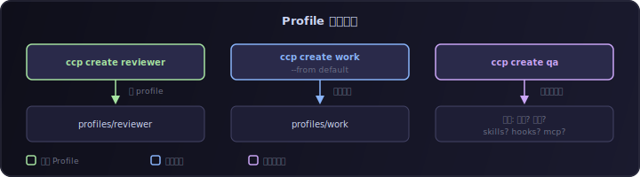
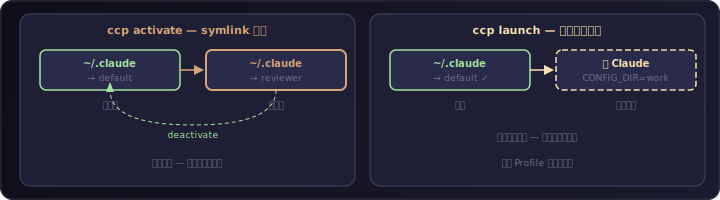
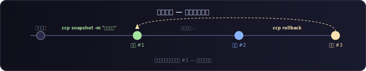

<p align="center">
  
</p>

<p align="center">
  <a href="https://www.npmjs.com/package/claude-code-profile"></a>
  <a href="https://www.npmjs.com/package/claude-code-profile"></a>
  <a href="https://github.com/HaloXie/claude-code-profile/blob/main/LICENSE"></a>
  <a href="https://nodejs.org"></a>
</p>

<p align="center">
  <b>Chrome-like profile management for <a href="https://docs.anthropic.com/en/docs/claude-code">Claude Code</a></b>
  <br/>
  <sub>Fully isolated profiles with selective import, version control, and parallel launch</sub>
</p>

<p align="center">
  <a href="#installation">Install</a> &#8226;
  <a href="#quick-start">Quick Start</a> &#8226;
  <a href="#commands">Commands</a> &#8226;
  <a href="#architecture">Architecture</a> &#8226;
  <a href="#中文文档">中文文档</a>
</p>

---

## Why?

Claude Code stores all configuration in a single `~/.claude` directory. When you need different personas, skills, or rules for different workflows — a strict code reviewer, a creative brainstormer, a company-specific assistant — you're stuck with one config for everything.

**ccp** gives you Chrome-like profiles. Each profile is a fully isolated `~/.claude` equivalent with its own `CLAUDE.md`, settings, plugins, skills, hooks, and memory.

<p align="center">
  
</p>

## Installation

```bash
npm install -g claude-code-profile
```

Alias: The CLI command is **`ccp`** (Claude Code Profile).

## Quick Start

```bash
# 1. Initialize — migrates your existing ~/.claude
ccp init

# 2. Create a new profile (interactive or from existing)
ccp create reviewer
ccp create work --from default

# 3. Switch profiles
ccp activate reviewer

# 4. Run a parallel instance without switching
ccp launch work

# 5. Check which profile is active
ccp current
```

## Architecture

<p align="center">
  
</p>

**Hybrid isolation with two complementary mechanisms:**

| Mechanism | Command | Use Case |
|-----------|---------|----------|
| **Symlink switching** | `ccp activate <name>` | Day-to-day profile switching. `~/.claude` symlink points to active profile. |
| **Env var override** | `ccp launch <name>` | Run multiple Claude instances simultaneously, each with a different profile. |

Each profile directory is a complete `~/.claude` equivalent with its own git repository for automatic version control.

### How Profile Isolation Works

Claude Code loads configuration from three scopes:

| Scope | Path | Overridden by `CLAUDE_CONFIG_DIR`? |
|-------|------|------------------------------------|
| **User** | `~/.claude/` | Yes |
| **Project** | `.claude/` in CWD + parent dirs | No |
| **Managed** | `/Library/Application Support/ClaudeCode/` | No |

**The problem**: When `ccp launch` sets `CLAUDE_CONFIG_DIR` to a different profile, the User scope is correctly redirected. However, Claude Code also traverses parent directories looking for project-level config. When it reaches `~/`, it finds `~/.claude/CLAUDE.md` (a symlink to the default profile) and loads it as a **Project-scope** file — leaking the default profile's configuration.

**The solution**: ccp automatically configures [`claudeMdExcludes`](https://docs.anthropic.com/en/docs/claude-code/settings) in each non-default profile's `settings.json`:

```json
{
  "claudeMdExcludes": [
    "/Users/you/.claude/CLAUDE.md",
    "/Users/you/.claude/rules/**"
  ]
}
```

This tells Claude Code to skip those paths during parent directory traversal. Combined with `CLAUDE_CONFIG_DIR`, this achieves complete isolation — enabling **concurrent multi-profile sessions** without symlink swapping or file locks.

## Commands

> **If you've used conda**, think of profiles as conda environments — but for Claude Code config instead of Python packages.
>
> | conda | ccp | What it does |
> |-------|-----|-------------|
> | `conda create -n myenv` | `ccp create myenv` | Create an isolated environment/profile |
> | `conda activate myenv` | `ccp activate myenv` | Switch into it |
> | `conda deactivate` | `ccp deactivate` | Switch back to default |
> | `conda env list` | `ccp list` | See all environments/profiles |
> | `conda env remove -n myenv` | `ccp delete myenv` | Remove one |

### Lifecycle — Setup & Teardown

<p align="center"></p>

| Command | What happens | When to use |
|---------|-------------|-------------|
| `ccp init` | Copies your `~/.claude` into `~/.claude-profiles/default`, creates a symlink `~/.claude → default`, backs up the original | **First time only.** One command, zero risk — original is backed up |
| `ccp pause` | Removes the symlink, restores `~/.claude` as a real directory | Temporarily stop using ccp (e.g., debugging) |
| `ccp resume` | Re-creates the symlink, goes back to profile management | Resume after pause |
| `ccp uninstall` | Removes all profiles, restores `~/.claude` to pre-ccp state | Completely remove ccp |

### Profile Management — Create, Clone, Organize

<p align="center"></p>

| Command | What happens | Example |
|---------|-------------|---------|
| `ccp create <name>` | Interactive wizard — pick a source profile and which items to import (auth, plugins, skills, etc.). Alias: `add` | `ccp create reviewer` — prompts you to choose what to include |
| `ccp create <name> --from <profile>` | Full clone — copies everything from an existing profile | `ccp create work --from default` — exact copy of default |
| `ccp delete <name>` | Deletes a profile (with confirmation). Refuses to delete the active or default profile. Alias: `remove` | `ccp delete old-project` |
| `ccp list` | Lists all profiles, marks the active one with `*` | Shows: `default *`, `coder` |
| `ccp info <name>` | Shows profile details: description, creation date, disk usage, git status | `ccp info reviewer` |
| `ccp rename <old> <new>` | Renames a profile directory and updates all references | `ccp rename reviewer strict-reviewer` |
| `ccp copy <src> <dst>` | Duplicates a profile (like `create --from` but for existing profiles) | `ccp copy work work-backup` |

### Activation — Switch & Launch

<p align="center"></p>

| Command | What happens | Example |
|---------|-------------|---------|
| `ccp activate <name>` | **Switches** the active profile — `~/.claude` symlink now points to `<name>`. Auto-snapshots before switching. | `ccp activate reviewer` — all Claude sessions now use reviewer config |
| `ccp deactivate` | Switches back to `default` profile | `ccp deactivate` — equivalent to `ccp activate default` |
| `ccp launch <name>` | **Starts a new Claude instance** with the given profile, **without switching** the active one. Uses `CLAUDE_CONFIG_DIR` env var. Alias: `run` | `ccp launch work` — opens Claude with work profile while you stay on default |
| `ccp current` | Prints the name of the active profile | Output: `default` |
| `ccp current --badge` | Prints `[name]` format for status bar integration | Output: `[reviewer]` |

> **activate vs launch**: `activate` is like `conda activate` — it changes your global state. `launch` is like running `conda run -n myenv python script.py` — it uses a profile for one session without changing anything globally.

### Import / Export — Share & Migrate

| Command | What happens | Example |
|---------|-------------|---------|
| `ccp import <target> --from <source>` | Selectively import items (auth, plugins, skills, hooks, mcp, rules, settings, memory) from one profile to another. **Field-level merge** — importing plugins won't overwrite your model settings. | `ccp import work --from reviewer --items skills hooks` |
| `ccp export <name> -o <path>` | Exports a profile as a `.ccp.tar.gz` archive. Auth excluded by default. | `ccp export reviewer -o ~/reviewer-backup.ccp.tar.gz` |
| `ccp import-archive <path>` | Imports a profile from a `.ccp.tar.gz` archive | `ccp import-archive ~/reviewer-backup.ccp.tar.gz` |

### Version Control — Snapshot & Rollback

<p align="center"></p>

| Command | What happens | Example |
|---------|-------------|---------|
| `ccp snapshot <name> [-m "msg"]` | Manually saves the current state as a git commit | `ccp snapshot reviewer -m "tuned prompts"` |
| `ccp history <name>` | Shows the snapshot timeline (git log) | `ccp history reviewer` — see all past snapshots |
| `ccp rollback <name>` | Interactive rollback — pick a snapshot to restore. **Non-destructive**: creates a new commit, never loses history | `ccp rollback reviewer` — pick from list of snapshots |

> Profiles also auto-snapshot on every `activate` / `deactivate`, so you always have a restore point.

### Health

| Command | What happens |
|---------|-------------|
| `ccp doctor` | Checks symlink integrity, profile directory validity, config consistency, and auto-repairs common issues |

### Shell Completion

```bash
# Enable tab completion (added automatically during `ccp init`)
eval "$(ccp completion zsh)"    # zsh
eval "$(ccp completion bash)"   # bash
ccp completion fish | source    # fish
```

After setup, type `ccp re<Tab>` to see `rename`, `resume`, `remove`, `rollback`.

> All commands support `-y, --yes` to skip confirmation prompts.

## Importable Items

When creating or importing between profiles, you can selectively choose:

| Item | What's Included |
|------|----------------|
| `auth` | API keys, tokens, credentials |
| `plugins` | Installed plugins + `enabledPlugins` config |
| `skills` | Skill definitions |
| `hooks` | Hook scripts + hook config |
| `mcp` | MCP server configurations |
| `rules` | Rule files, constitution |
| `settings` | `settings.json`, `settings.local.json` |
| `memory` | Project memory files |
| `conversations` | History, sessions |

Settings fields (`enabledPlugins`, `hooks`, `mcpServers`) are merged at **field level**, not file level — importing plugins won't overwrite your model or permission settings.

## Version Control

Every profile is a git repository. Configuration changes are tracked automatically:

- **Auto-commit** on `activate` / `deactivate` (snapshot before switching)
- **Manual snapshot** via `ccp snapshot <name> -m "description"`
- **Non-destructive rollback** via `ccp rollback <name>` (creates a new commit, preserves history)

## Safety

| Scenario | Protection |
|----------|-----------|
| `init` failure | Copy-then-verify-then-symlink; original backed up; rollback on any step failure |
| Concurrent operations | Atomic lock file with stale PID detection |
| Symlink switch | Atomic: temp symlink + rename (POSIX atomic) |
| `activate` / `pause` / `uninstall` while Claude running | Detects claude process, warns user (`--force` to override) |
| `delete` active / default | Refused |
| `export` | Auth excluded by default (`--include-auth` to override) |
| `pause` / `uninstall` | Restores real `~/.claude`; status bar restored to original |

## Plugin Shared Store

ccp uses a **pnpm-style shared store** for plugins. Instead of copying plugin files into every profile, plugins are stored once in a central location and shared via symlinks.

```
~/.claude-profiles/.store/          ← Shared store (single copy of each plugin)
    cache/official/superpowers/     ← Plugin entity
    marketplaces/                   ← Marketplace metadata

~/.claude-profiles/default/plugins/
    cache/official/
        superpowers → ../.store/cache/official/superpowers  (symlink)
    installed_plugins.json          ← Per-profile (controls which plugins are enabled)
```

**How it works:**
- `ccp init` migrates existing plugins to the shared store
- Each profile's `plugins/cache/` contains symlinks, not copies
- Claude Code's install/update/disable operations work transparently through symlinks
- New plugins installed by Claude are automatically migrated to the store on `activate` / `snapshot`
- `ccp pause` / `ccp export` dereference symlinks back to real directories

**Environment variables** (set automatically during `ccp init`):

| Variable | Default | Purpose |
|----------|---------|---------|
| `CCP_HOME` | `~/.claude-profiles` | Profiles root directory |
| `CCP_STORE` | `$CCP_HOME/.store` | Shared store location (independently configurable) |

### Maintenance

| Command | What happens |
|---------|-------------|
| `ccp gc` | Finds and removes orphaned plugins from the store (plugins no longer referenced by any profile) |

## Status Bar

ccp composes with your existing Claude Code status bar (doesn't override):

```
[reviewer] Your existing status line output here
```

Use `ccp current --badge` in custom status bar scripts.

## Contributing

Contributions are welcome! Please open an issue or submit a PR.

```bash
git clone https://github.com/HaloXie/claude-code-profile.git
cd claude-code-profile
pnpm install
pnpm test        # Run tests
pnpm dev --help  # Run CLI in dev mode
```

## License

[MIT](LICENSE)

---

<a id="中文文档"></a>

# 中文文档

## 简介

**ccp** (Claude Code Profile) 为 [Claude Code](https://docs.anthropic.com/en/docs/claude-code) 提供类似 Chrome 浏览器的配置文件管理功能。每个 Profile 是完全隔离的 `~/.claude` 等价目录，拥有独立的 `CLAUDE.md`、设置、插件、Skills、Hooks 和记忆。

## 为什么需要 ccp？

Claude Code 将所有配置存储在单一的 `~/.claude` 目录中。当你需要不同的人格来完成不同的工作流时——严格的代码审查者、创意头脑风暴者、公司专属助手——你只能共用一套配置。

**ccp** 让你可以为每个场景创建独立的 Profile，像切换 Chrome 用户一样切换 Claude Code 的身份。

## 安装

```bash
npm install -g claude-code-profile
```

CLI 命令别名：**`ccp`**

## 快速开始

```bash
# 1. 初始化 — 迁移现有的 ~/.claude
ccp init

# 2. 创建新 Profile（交互式或从现有 Profile 克隆）
ccp create reviewer
ccp create work --from default

# 3. 切换 Profile
ccp activate reviewer

# 4. 并行启动（不切换当前 Profile）
ccp launch work

# 5. 查看当前激活的 Profile
ccp current
```

## 核心特性

### 完全隔离
每个 Profile 是独立的 `~/.claude` 目录，拥有自己的：
- `CLAUDE.md`（指令文件）
- `settings.json`（模型、权限、环境变量）
- 插件、Skills、Hooks、Rules
- MCP 服务器配置
- 项目记忆和对话历史

### 选择性导入
创建 Profile 时可以从现有 Profile 选择性导入：认证、插件、Skills、Hooks、MCP、规则、设置、记忆、对话。设置字段级合并，不会覆盖目标的其他配置。

### 混合隔离机制
- **主要方式**：`ccp activate` — Symlink 切换（原子操作）
- **并行方式**：`ccp launch` — 通过 `CLAUDE_CONFIG_DIR` 环境变量启动独立实例

### Profile 隔离原理

Claude Code 从三个作用域加载配置：

| 作用域 | 路径 | 受 `CLAUDE_CONFIG_DIR` 影响？ |
|--------|------|------------------------------|
| **User** | `~/.claude/` | 是 |
| **Project** | CWD 及父目录的 `.claude/` | 否 |
| **Managed** | `/Library/Application Support/ClaudeCode/` | 否 |

**问题**：`ccp launch` 通过 `CLAUDE_CONFIG_DIR` 将 User 作用域重定向到目标 Profile。但 Claude Code 还会遍历父目录查找项目级配置——当遍历到 `~/` 时，发现 `~/.claude/CLAUDE.md`（指向 default Profile 的 symlink），会作为 **Project 作用域** 加载，导致 default 的配置泄漏到其他 Profile。

**解决方案**：ccp 在创建非 default Profile 时，自动在 `settings.json` 中配置 `claudeMdExcludes`，告诉 Claude Code 在父目录遍历时跳过 `~/.claude/CLAUDE.md` 和 `~/.claude/rules/**`。配合 `CLAUDE_CONFIG_DIR`，实现完整的 Profile 隔离——**支持并发多 Profile 会话**，无需切换 symlink 或文件锁。

### 版本控制
每个 Profile 目录是一个 Git 仓库：
- 切换 Profile 时自动快照
- `ccp snapshot` 手动创建快照
- `ccp rollback` 非破坏性回滚（保留完整历史）

### 安全机制
- `init` 失败时自动回滚，原始目录备份保留
- `activate` / `pause` / `uninstall` 检测 Claude 进程运行状态（`--force` 跳过）
- 原子锁文件 + 过期 PID 检测
- Symlink 原子切换（temp + rename）
- `export` 默认排除认证信息
- `delete` 拒绝删除激活或默认 Profile

### 插件共享存储

ccp 采用类似 **pnpm 的共享存储**机制管理插件。插件实体集中存放在共享位置，各 Profile 通过 symlink 引用，避免重复复制。

- `ccp init` 时自动将现有插件迁移到共享存储
- 每个 Profile 的 `plugins/cache/` 下是 symlink，不是副本
- Claude Code 的安装/更新/禁用操作通过 symlink 透明生效
- 新安装的插件在 `activate` / `snapshot` 时自动迁移到共享存储
- `ccp pause` / `ccp export` 时自动还原为真实目录

**环境变量**（`ccp init` 时自动设置）：

| 变量 | 默认值 | 用途 |
|------|--------|------|
| `CCP_HOME` | `~/.claude-profiles` | Profile 根目录 |
| `CCP_STORE` | `$CCP_HOME/.store` | 共享存储位置（可独立配置） |

| 命令 | 做了什么 |
|------|---------|
| `ccp gc` | 查找并删除共享存储中的孤儿插件（不再被任何 Profile 引用的插件） |

## 命令详解

> **用过 conda？** 把 Profile 想象成 conda 环境 —— 只不过管理的是 Claude Code 配置，而不是 Python 包。
>
> | conda | ccp | 做什么 |
> |-------|-----|--------|
> | `conda create -n myenv` | `ccp create myenv` | 创建隔离环境/Profile |
> | `conda activate myenv` | `ccp activate myenv` | 切换进去 |
> | `conda deactivate` | `ccp deactivate` | 回到默认 |
> | `conda env list` | `ccp list` | 查看所有环境/Profile |
> | `conda env remove -n myenv` | `ccp delete myenv` | 删除 |

### 生命周期 — 安装与卸载

<p align="center"></p>

| 命令 | 做了什么 | 什么时候用 |
|------|---------|-----------|
| `ccp init` | 把 `~/.claude` 复制到 `~/.claude-profiles/default`，创建 symlink，备份原始目录 | **首次使用**，一条命令，零风险（原始目录已备份） |
| `ccp pause` | 临时移除 symlink，恢复 `~/.claude` 为真实目录 | 临时停用 ccp（比如排查问题） |
| `ccp resume` | 重新创建 symlink，恢复 Profile 管理 | pause 之后恢复 |
| `ccp uninstall` | 移除所有 Profile，恢复 `~/.claude` 到 ccp 之前的状态 | 完全卸载 ccp |

### Profile 管理 — 创建、克隆、整理

<p align="center"></p>

| 命令 | 做了什么 | 示例 |
|------|---------|------|
| `ccp create <name>` | 交互式向导 —— 选择源 Profile 和要导入的项目（认证、插件、skills 等）。别名：`add` | `ccp create reviewer` 会提示你选择要包含哪些内容 |
| `ccp create <name> --from <profile>` | 完整克隆 —— 从现有 Profile 复制所有内容 | `ccp create work --from default` 得到 default 的完整副本 |
| `ccp delete <name>` | 删除 Profile（需确认）。拒绝删除激活中或 default Profile。别名：`remove` | `ccp delete old-project` |
| `ccp list` | 列出所有 Profile，用 `*` 标记激活中的 | 显示：`default *`、`coder` |
| `ccp info <name>` | 显示 Profile 详情：描述、创建时间、磁盘占用、git 状态 | `ccp info reviewer` |
| `ccp rename <old> <new>` | 重命名 Profile 目录并更新所有引用 | `ccp rename reviewer strict-reviewer` |
| `ccp copy <src> <dst>` | 复制 Profile（类似 `create --from`，用于已有 Profile） | `ccp copy work work-backup` |

### 激活 — 切换与并行启动

<p align="center"></p>

| 命令 | 做了什么 | 示例 |
|------|---------|------|
| `ccp activate <name>` | **切换**激活 Profile —— `~/.claude` symlink 指向 `<name>`。切换前自动快照。 | `ccp activate reviewer` 之后所有 Claude 会话使用 reviewer 配置 |
| `ccp deactivate` | 切回 `default` Profile | `ccp deactivate` 等同于 `ccp activate default` |
| `ccp launch <name>` | **启动新 Claude 实例**使用指定 Profile，**不切换**当前激活的 Profile。通过 `CLAUDE_CONFIG_DIR` 环境变量实现。别名：`run` | `ccp launch work` 打开使用 work 配置的 Claude，当前仍在 default |
| `ccp current` | 打印当前激活的 Profile 名称 | 输出：`default` |
| `ccp current --badge` | 打印 `[name]` 格式，用于状态栏集成 | 输出：`[reviewer]` |

> **activate vs launch**：`activate` 像 `conda activate` —— 改变全局状态，所有新会话都受影响。`launch` 像 `conda run -n myenv python script.py` —— 只为这一次会话使用特定 Profile，全局不变。

### 导入 / 导出 — 分享与迁移

| 命令 | 做了什么 | 示例 |
|------|---------|------|
| `ccp import <target> --from <source>` | 从一个 Profile 选择性导入项目到另一个。**字段级合并** —— 导入插件不会覆盖你的模型设置。 | `ccp import work --from reviewer --items skills hooks` |
| `ccp export <name> -o <path>` | 导出 Profile 为 `.ccp.tar.gz` 归档。默认排除认证信息。 | `ccp export reviewer -o ~/reviewer.ccp.tar.gz` |
| `ccp import-archive <path>` | 从归档文件导入 Profile | `ccp import-archive ~/reviewer.ccp.tar.gz` |

### 版本控制 — 快照与回滚

<p align="center"></p>

| 命令 | 做了什么 | 示例 |
|------|---------|------|
| `ccp snapshot <name> [-m "msg"]` | 手动保存当前状态为 git commit | `ccp snapshot reviewer -m "调优提示词"` |
| `ccp history <name>` | 查看快照时间线（git log） | `ccp history reviewer` 查看所有历史快照 |
| `ccp rollback <name>` | 交互式回滚 —— 选择一个快照来恢复。**非破坏性**：创建新提交，不丢失任何历史 | `ccp rollback reviewer` 从列表中选择 |

> 每次 `activate` / `deactivate` 都会自动快照，所以你永远有恢复点。

### 健康检查

| 命令 | 做了什么 |
|------|---------|
| `ccp doctor` | 检查 symlink 完整性、Profile 目录有效性、配置一致性，自动修复常见问题 |

### Shell 补全

```bash
# 启用 Tab 补全（ccp init 时自动添加到 shell 配置）
eval "$(ccp completion zsh)"    # zsh
eval "$(ccp completion bash)"   # bash
ccp completion fish | source    # fish
```

设置后输入 `ccp re<Tab>` 即可看到 `rename`、`resume`、`remove`、`rollback`。

> 所有命令支持 `-y, --yes` 跳过确认提示。

## 许可证

[MIT](LICENSE)
